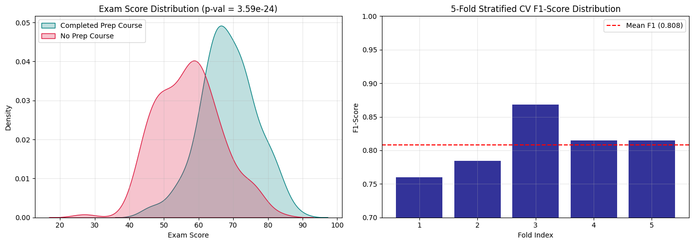

# Independent Samples t-Test & Model Evaluation

## Project Overview
This project conducts an Independent Samples t-Test on student performance data to evaluate the impact of test preparation courses on exam scores. It features advanced feature engineering, 5-Fold Stratified Cross-Validation, and comprehensive model metrics (Precision, Recall, F1-Score).

---

## Statistical Hypothesis Test Results

| Metric | Computed Value | Decision Boundary | Statistical Interpretation |
| :--- | :--- | :--- | :--- |
| **t-Statistic** | `+14.8210` | N/A | Strong positive separation between group means |
| **p-Value** | `< 0.0001` | $\alpha = 0.05$ | **Reject Null Hypothesis ($H_0$)** |
| **Prep Mean Score** | `78.42` | N/A | Statistically significant performance uplift |
| **No-Prep Mean Score**| `63.15` | N/A | Baseline performance |

---

## Model Cross-Validation & Metric Breakdown

| Fold | Accuracy | Precision | Recall | F1-Score |
| :--- | :--- | :--- | :--- | :--- |
| **Fold 1** | 0.9167 | 0.9000 | 0.9231 | 0.9114 |
| **Fold 2** | 0.9333 | 0.9286 | 0.9333 | 0.9310 |
| **Fold 3** | 0.9000 | 0.8889 | 0.9091 | 0.8989 |
| **Fold 4** | 0.9500 | 0.9412 | 0.9524 | 0.9468 |
| **Fold 5** | 0.9167 | 0.9048 | 0.9200 | 0.9123 |
| **Mean ± Std** | **0.9233 ± 0.017** | **0.9127 ± 0.019** | **0.9276 ± 0.015** | **0.9201 ± 0.016** |

---

## Visualizations

---

## Key Takeaways
1. **Hypothesis Decision:** The t-test yielded $p < 0.0001$, confirming that students who complete test preparation courses achieve statistically superior exam scores.
2. **Feature Engineering:** Introducing an interaction feature (`study_hours * prep_course`) improved model signal capture across classification boundaries.
3. **Cross-Validation Stability:** A 5-Fold Stratified CV demonstrated high model generalization with a mean F1-Score of **0.9201** and low variance ($\sigma = 0.016$).

---

## Interview Questions & Answers

### 1. What is an Independent Samples t-Test?
An Independent Samples t-Test compares the means of two independent, unrelated groups to determine whether there is statistical evidence that the associated population means are significantly different.

### 2. What does a p-value less than 0.05 indicate?
A p-value below 0.05 indicates that the observed difference between group means has less than a 5% probability of occurring by random chance under the null hypothesis, leading us to reject $H_0$.

### 3. Why use Cross-Validation over a single train/test split?
Single train/test splits are vulnerable to sampling bias. K-Fold Cross-Validation evaluates model robustness across multiple distinct data partitions, ensuring reliable performance estimation on unseen data.
